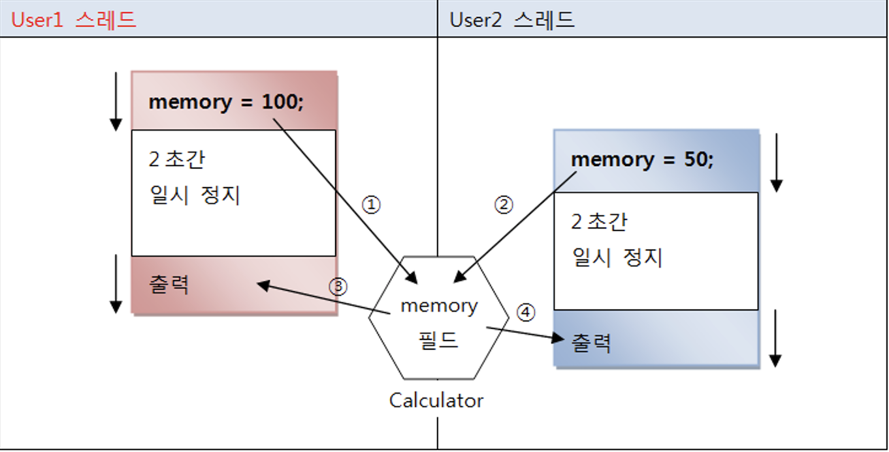
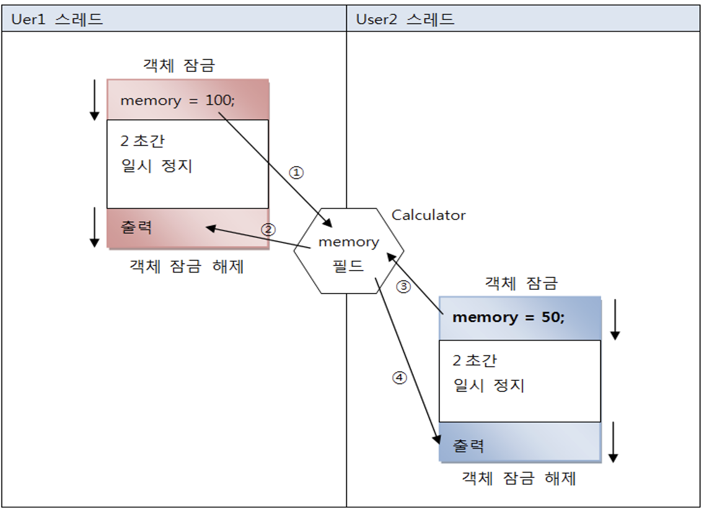
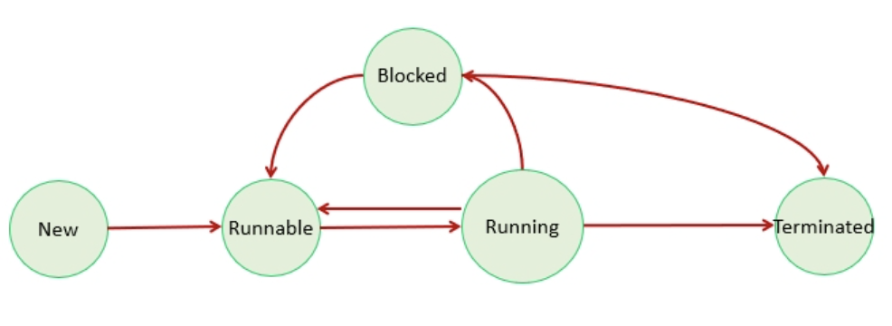
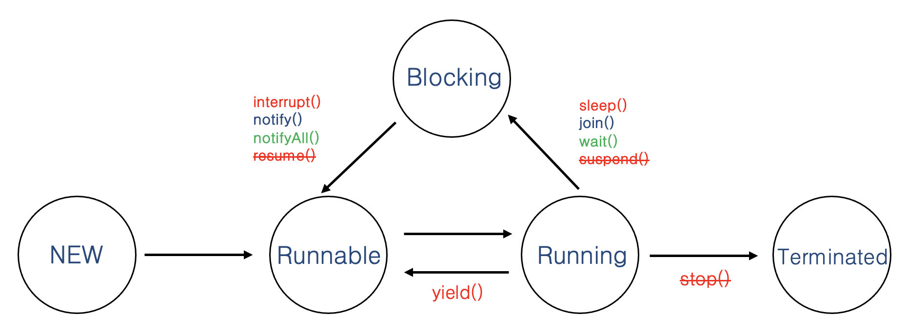
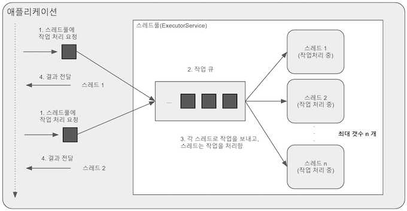

# Chpater12. 멀티 스레드

## 멀티 스레드 개념

### 프로세스와 스레드

#### 멀티 테스킹

- 두가지 이상의 작업을 동시에 처리하는 것.

- 운영체제는 CPU 및 메모리 자원을 프로세스마다 적절히 할당하고, 병렬로 실행

- 멀티 프로세스 : 프로세스 마다 독립된 메모리를 가지고 있다.

- 멀티 스레드 : 하나의 프로세스 내 메모리를 공유한다.


### 메인 스레드

- main() 메소드를 실행하면서 시작하고 첫 코드부터 순차적으로 실행

- 필요에 따라 작업 스레드를 만들어서 병렬로 코드를 실행

- 프로세스는 모든 스레드가 종료되어야 종료된다.

<br>

## 작업 스레드 생성과 실행

- java.lang.Thread 클래스를 직접 객체화해서 생성

- Thread를 상속해서 하위 클래스를 만들어 생성


### Thread 클래스로부터 직접 생성

```java
// Runnable을 매개값으로 갖는 생성자 호출
Thread thread = new Thread(Runnable target);

// Runnable은 인터페이스 타입이기 대문에 구현 객체를 만들어 대입
class Task implements Runnable {
    public void run() {
        스레드가 실행할 코드;
    }
}

// Runnable 객체를 매개값으로 갖는 Thread 생성자 호출
// 비로소 작업 스레드가 생성됨 
Runnalbe task = new Task();
Thread thread = new Thread(task);

// 스레드의 실행
thread.start();

// 람다식 이용
Thread thread = new Thread(
    () -> {
        스레드가 실행할 코드;
    }
);
thread.start();
```

### Thread 하위 클래스로부터 생성

Thread 클래스를 상속한 후 run 메소드를 Overriding 해서 스레드가 실행할 코드를 작성

```java
public class WorkerThread extends Thread {
    @Override
    public void run() {
        // 스레드가 실행할 코드
    }
}
Thread thread = new WorkerThread();

// 익명 객체로 생성
Thread thread = new Thread() {
    public void run() {
        스레드가 샐행할 코드;
    }
}
```

### Thread의 이름

스레드의 이름은 디버깅 할때 유용

```java
// 스레드 객체의 참조를 가지고 있을 때.
thread1.setName("스레드 이름");
thread1.getname();
// 가지고 있지 않다면
Thread thread2 = Thread.currentThread(); // 스레드 객체의 참조를 얻을 수 있다.
```

<br>

## 스레드 우선순위

- **동시성(Concurrency)** : `하나의 코어`에서 멀티 스레드가 번갈아가며 실행하는 성질

- **병렬성(Parallelism)** : `멀티 코어`에서 개별 스레드를 동시에 실행하는 성질

    

### 스레드 스케쥴링

- 스레드의 개수가 코어의 수보다 많을 경우

- 스레드를 어떤 순서에 의해 동시성으로 실행할 것인가를 결정하는 것

#### 우선순위(Priority) 방식

- 우선순위가 높은 스레드가 실행 상태(CPU 자원)를 더 많이 가지도록 하는 스케쥴링

- 스레드 객체에 우선 순위 번호를 부여할 수 있어, 개발자가 코드로 제어 가능

```java
thread.setPriority(우선순위); // 1 ~ 10 까지 설정 가능, 10이 가장 높다.

// 코드의 가독성을 위해 스레드 상수를 이용
thread.setPriority(Thread.MAX_PRIORITY); // 10
thread.setPriority(Thread.NORM_PRIORITY); // 5
thread.setPriority(Thread.MIN_PRIORITY); // 1
```

#### 순환 할당(Round-Robin) 방식

- 시간 할당량(Time Slice)을 정해서 하나의 스레드를 정해진 시간만큼 실행하고 다시 다른 스레드를 실행하는 방식

- 자바 가상 머신(JVM)에 의해서 정해지기 때문에, 개발자가 제어 불능

<br>

## 동기화 메소드와 동기화 블록

### 공유 객체를 사용할 때의 주의할 점

두 스레드가 동일한 메모리 필드에 접근하고자 할 때



user1의 결과가 100이 아니라 50이 나온다.


### 동기화 메소드 및 동기화 블록

- 스레드가 사용중인 객체를 다른 스레드가 변경할 수 없도록 하려면

- 스레드 작업이 끝날 때까지 `객체에 잠금을 걸어서` 다른 스레드가 사용할 수 없도록 해야한다.

- 임계영역(critical section) : 멀티 스레드 프로그램에서 `단 하나의 스레드만 실행할 수 있는 코드 영역`

- 임계 영역을 지정하기 위해 동기화(synchronized) 메소드와 동기화 블럭을 제공

- 스레드가 객체 내부의 동기화 메소드 또는 블록에 들어가면 `즉시 객체에 잠금을 걸어` 다른 스레드가 임계 영역 코드를 실행하지 못하도록 한다.

#### 동기화 메소드

- 메소드 선언 앞에 synchronized 키워드를 붙인다.

- 메소드 전체에 잠금이 일어난다.

```java
public synchronized void method() {
    임계 영역; // 단 하나의 스레드만 실행 가능
}
```

#### 동기화 블럭

- 메소드 일부 영역에 잠금이 일어난다.

```java
public void method() {
    // 여러 스레드가 실행 가능 영역
    synchronized(공유객체) {
    // 임계영역 : 단 하나의 스레드만 실행 가능
    }
    // 여러 스레드가 실행 가능 역역
}
```



**주의점**
- 동기화 블럭과 동기화 메소드가 여러개 있을 경우, 스레드가 이들 중 하나를 실행할 때 다른 스레드는 해당 메소드는 물론 다른 동기화 메소드 및 블록도 실행 할 수 없다.

<br>

## 스레드 상태

1. start() 메소드를 호출하면 스레드가 `실행 대기 상태`가 된다.
    - 실행 대기 상태 : `아직 스케쥴링이 되지 않아서` 실행을 기다리고 있는 상태

2. 실행 대기 상태에 있는 스레드 중에서 스레드 `스케쥴링으로 선택된 스레드`가 비로소 CPU를 점유하고 run() 메소드를 실행

    - 이때가 `실행(Running) 상태`

3. 실행 상태의 스레드는 run() 메소드를 모두 실행하기 전에 스레드 스케쥴링에 의해 다시 `실행 대기(Blocked) 상태`가 된다.

    - `실행 대기 상태와 실행 상태를 번갈아가면서` 자신의 run() 메소드를 조금씩 실행

4. 실행 상태에서 `run()메소드가 종료되면`, 더이상 실행할 코드가 없기 때문에 실행은 멈추게 된다

    - 이 상태를 `실행 종료 상태`



<table>
    <thead>
        <tr>
            <th>상태</th>
            <th>열거 상수</th>
            <th>설명</th>
        </tr>
    </thead>
    <tbody>
        <tr>
            <td>객체 생성</td>
            <td>New</td>
            <td>스레드 객체가 생성, 아직 start() 메소드가 호출되지 않은 상태</td>
        </tr>
        <tr>
            <td>실행 대기</td>
            <td>Runnable</td>
            <td>실행 상태로 언제든지 갈 수 있는 상태</td>
        </tr>
        <tr>
            <td rowspan=3>일시 정지</td>
            <td>Waiting</td>
            <td>다른 스레드가 통지할 때까지 기다리는 상태</td>
        </tr>
        <tr>
            <td>Timed_waiting</td>
            <td>주어진 시간동안 기다리는 상태</td>
        </tr>
        <tr>
            <td>Blocked</td>
            <td>사용하고자 하는 객체의 락이 풀릴 때까지 기다리는 상태</td>
        </tr>
        <tr>
            <td>종료</td>
            <td>Terminated</td>
            <td>실행을 마친 상태</td>
        </tr>
    </tbody>
</table>

<br>

## 스레드 상태 제어



### sleep() : 주어진 시간동안 일시 정지

- Thread.sleep();

- 주어진 시간동안 일시 정지 상태가 되고 다시 실행 대기 상태가 된다.

### yield() : 다른 스레드에게 실행 양보

-  Thread.yield();

- yield() 메소드를 호출한 스레드는 실행 대기 상태로 돌아가고 

- 동일한 우선순위 또는 높은 우선순위를 갖는 다른 스레드가 실행 기회를 가질 수 있게 해준다.


### join() : 다른 스레드의 종료를 기다림

- 예를 들어 계산 작업을 하는 스레드가 모든 계산 작업을 마쳤을 때, 계산 결과를 받아 이용하는 경우가 이에 해당한다.

```java
// ThreadA
threadB.start();
threadB.join(); // threadB가 종료 될때까지 일시 정지하며 기다린다.

// ThreadB
run(){
}
```

### wait(), notify(), notifyAll() : 스레드간 협업

- 두개의 스레드를 `교대로 번갈아가며` 실행해야 하는 경우

- 자신의 작업이 끝나면 상대방 스레드를 일시 정지 상태에서 풀어주고, 자신은 일시정지 상태로 만든다.

- 핵심은 `공유 객체` : 두 스레드가 작업할 내용을 각각 동기화 메소드로 구분

- notify() : 작업이 완료됨을 알림, 일시 정지상태에 있는 다른 스레드를 실행 대기 상태로 만듬.

- wait() : 자신을 일시 정지 상태로 만듬.

#### 예제

데이터를 저장하는 스레드(생산자)가 데이터를 저장하면, 데이터를 소비하는 스레드(소비자)가 데이터를 읽고 처리하는 교대 작업

- 공유 객체(DataBox)에 data 필드 값이 null이면 생산자 스레드를 실행 대기 상태, 소비자 스레드를 일시 정지 상태로 만든다.

- 공유 객체(DataBox)에 data 필드 값이 null이 아니면 소비자 스레드를 실행 대기 상태, 생상자 스레드를 일시 정지 상태로 만든다.

```java 
class DataBox{
    private String data;

    public synchronized String getData() {
        // data 필드가 null이면 소비자 스레드를 일시 정지 상태로 만듬, 두번 읽는 것을 방지.
        if (this.data == null) { 
            try {
                wait();
            }catch (InterruptedException e){}
        }
        // 소비자 스레드가 데이터를 읽음.
        String returnValue = data;
        System.out.println("ConsumerThread 가 읽은 데이터: " + returnValue);

        // data 필드를 null로 만들고 생산자 스레드를 실행 대기 상태로 만듬.
        data = null;
        notify();
        return returnValue;
    }

    public synchronized void setData(String data) {
        // data 필드가 null이 아니면 생산자 스레드를 일시 정지 상태로 만듬, 두번 쓰는 것을 방지.
        if (this.data != null) {
            try {
                wait();
            }catch (InterruptedException e){}
        }

        // data 필드에 값을 저장하고 소비자 스레드를 실행 대기 상태로 만듬.
        this.data = data;
        System.out.println("ProducerThread가 생성한 데이터: " + data);
        notify();
    }
}
```

데이터를 생산(저장)하는 스레드

```java
class ProducerThread extends Thread {
    private DataBox dataBox;

    public ProducerThread(DataBox dataBox) {
        this.dataBox = dataBox;
    }

    @Override
    public void run() {
        for (int i = 1; i <= 3; i++) {
            String data = "Data-" + i;
            dataBox.setData(data);
        }
    }
}
```

데이터를 소비하는(읽는) 스레드

```java
class ConsumerThread extends Thread {
    private DataBox dataBox;

    public ConsumerThread(DataBox dataBox) {
        this.dataBox = dataBox;
    }

    @Override
    public void run() {
        for (int i = 1; i <= 3; i++) {
            String data = dataBox.getData();
        }
    }
}
```

두 스레드를 생성하고 실행하는 메인 스레드

```java
public class WaitNotifyExample {
    public static void main(String[] args) {
        DataBox dataBox = new DataBox();

        ProducerThread producerThread = new ProducerThread(dataBox);
        ConsumerThread consumerThread = new ConsumerThread(dataBox);

        consumerThread.start();
        producerThread.start();
    }
}
```

### stop 플래그, interrupt() 스레드의 안전한 종료

- 스레드는 자신의 run() 메소드가 모두 실행되면 자동적으로 종료된다.
    
    - 스레드가 사용한 자원을 `안전하게` 정리

- 경우에 따라서 실행 중인 스레드를 즉시 종료할 필요가 있다.

- stop() : deprecated -> 파일, 네트워크 등 자원이 불안전한 상태로 남겨짐.


#### stop 플래그를 이용하자.

```java
public class XXXThread extends Thread {
    private boolean stop; // stop 플래그 필드

    // 다른 스레드에서 stop값 변경
    public void setStop(boolean stop) {
        this.stop = stop;
    }

    @Override
    public void run() {
        while(!stop){
            // 스레드가 반복 실행하는 코드
        }
        // 스레드가 사용한 자원 정리
    }
}
```

#### interrupt() 메소드를 이용하는 방법

- interrupt() : 스레드가 `일시 정지 상태`에 있을 때 InterruptedException 예외를 발생

- run() 메소드를 정상 종료

- `스레드가 실행 대기 또는 실행 상태에 있을 때` interrupt() 메소드가 실행되면 즉시 InterruptedException 예외가 발생하지 않고, `스레드가 미래에 일시 정지 상태가 되면` InterruptedException 예외가 발생한다.

- interrupt() 의 호출 여부 확인
    ```java
    boolean status = Thread.interrupted();
    boolean status = objThread.isInterrupted();
    ```

### 데몬 스레드

- 주 스레드의 작업을 돕는 보조적인 역할을 수행하는 스레드

- 주 스레드가 종료되면 데몬 스레드는 강제적으로 자동 종료

- 예: 워드프로세서의 자동 저장, 미디어 플레이어의 동영상 및 음악 재생, JVM의 가비지 컬렉터

```java 
public static void main(String[] args){
    AutoSaveThread thread = new AutoSaveThread();
    thread.setDemon(ture); // 메인 스레드의 데몬 스레드로 설정
    thread.start();
}
```

### 스레드 그룹

- 관련된 스레드를 묶어서 관리

- 스레드는 반드시 하나의 스레드 그룹에 포함

- 명시적으로 스레드 그룹에 포함시키지 않으면 기본적으로 자신을 생성한 스레드와 같은 스레드 그룹에 속하게 된다.

### 스레드 그룹이름 얻기

- 현재 스레드가 속한 스레드 그룹 이름 얻기
 
    ```java
    ThreadGroup group = Thread.currentThread().getThreadGroup();
    String groupName = group.getName()
    ```

- 프로세스 내에서 실행되는 모든 스레드에 대한 정보 얻기

    ```java
    Map<Thread, StackTraceElement[]> allStackTraces = Thread.getAllStackTraces();
    ```


### 스레드 그룹 생성

```java
new ThreadGroup(String name);
new ThreadGroup(ThreadGroup parent, String name);
```

### 스레드 그룹의 일괄 interrupt()

- 스레드 그룹에서 제공하는 interrupt() 메소드를 이용하면 그룹 내에 포함된 모든 스레드를 일괄 interrupt할 수 있다.

- 스레드 그룹의 interrupt() 메소드는 포함된 모든 스레드의 interrupt() 메소드를 내부적으로 호출

- 소속된 스레드의 interrupt() 메소드만 호출할 뿐 개별 스레드에서 발생하는 InterruptedException에 대한 예외 처리는 개별 스레드가 직접 해야한다.

## 스레드 풀(Thread Pool)

- 병렬 작업 처리가 많아지면 스레드 개수가 증가되고 그에 따른 스레드 생성과 스케쥴링으로 인해 CPU가 바빠져 메모리 사용량이 늘어난다. (애플리케이션의 성능 저하)

- 갑작스런 병렬 작업의 폭증으로 인한 스레드의 폭증을 막으려면 스레드 풀을 사용해야한다.

- 작업 처리에 사용되는 스레드를 제한된 개수많큼 정해 놓고 작업 큐에 들어오는 작업들을 하나씩 스레드가 맡아서 처리한다.

- 작업 처리가 끝난 스레드는 다시 작업 큐에서 새로운 작업을 가져와 처리한다.

    


